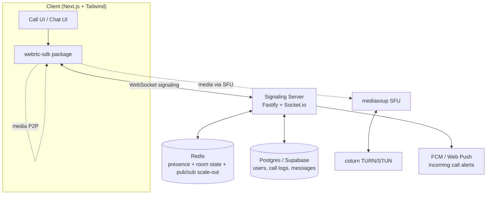
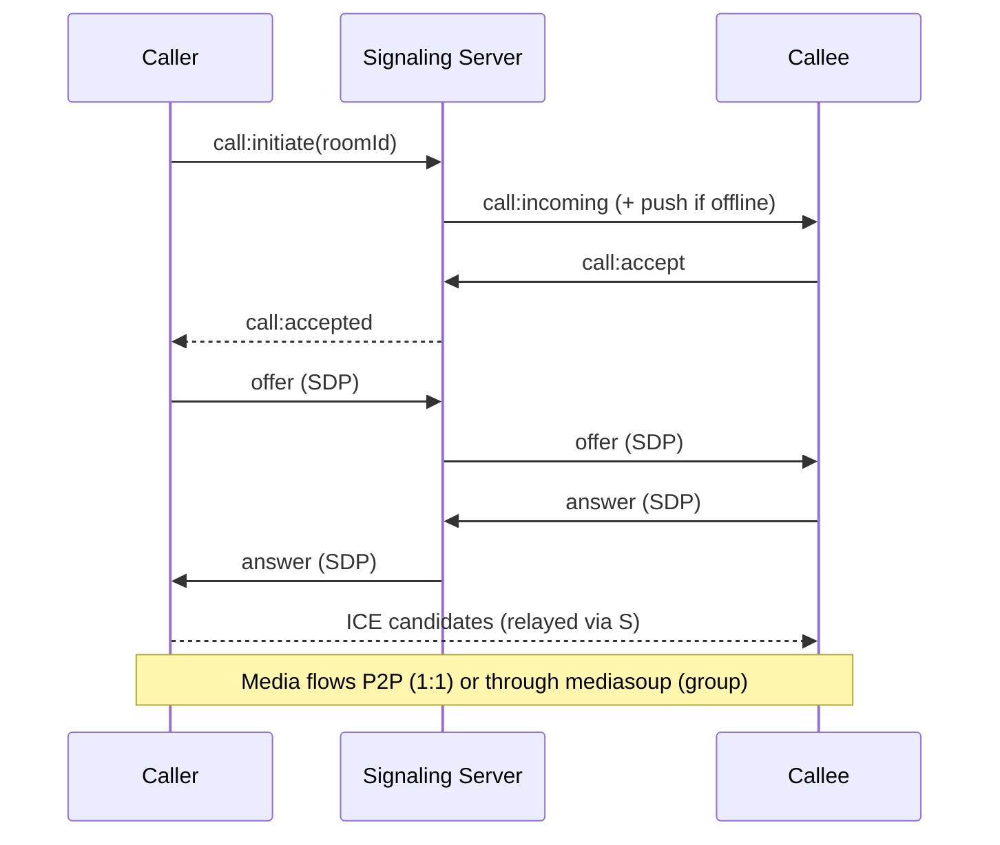

# WebRTC Production Platform — PLAN.md

## Status Legend
⬜ Not Started · 🔄 In Progress · ✅ Done · ⏸ Blocked

Update the dashboard + checklists below as work lands. Flip status and check items as each task completes.

## 0. Status Dashboard

## 0. Status Dashboard

| # | Phase | Status | Progress |
|---|-------|--------|----------|
| 0 | Foundation & Infra | ✅ | 100% |
| 1 | Signaling Core | ✅ | 100% |
| 2 | 1:1 P2P Calling | ✅ | 100% |
| 3 | Group Calling (SFU) | ✅ | 100% |
| 4 | Screen Share | ✅ | 100% |
| 5 | Chat / Messaging | ✅ | 100% |
| 6 | UI/UX (Tailwind + Motion) | ✅ | 100% |
| 7 | Reliability & Reconnection | ✅ | 100% |
| 8 | Security & E2EE | ✅ | 100% |
| 9 | SDK Packaging & Integration | ✅ | 100% |
| 10 | Scaling & Observability | ✅ | 100% |

## 1. Objective

Production-grade, self-hostable WebRTC platform with WhatsApp-tier calling/chat features. Ships as a monorepo with a standalone embeddable SDK so it drops into other projects (e.g. BJCC, Quiki) without rebuilding call infra each time.

## 2. Feature Matrix (WhatsApp Parity)

| Feature | Priority | Phase |
|---|---|---|
| 1:1 voice call | P0 | 2 |
| 1:1 video call | P0 | 2 |
| Group voice call | P0 | 3 |
| Group video call (grid / speaker view) | P0 | 3 |
| Screen share (+ system audio) | P0 | 4 |
| Text chat + typing indicator + read receipts | P0 | 5 |
| Presence (online / last seen) | P0 | 5 |
| Incoming-call push (background/offline) | P0 | 7 |
| Mute / camera toggle / device switch | P0 | 2 |
| Auto-reconnect on network drop | P0 | 7 |
| Call history log | P1 | 5 |
| Network quality indicator | P1 | 7 |
| Virtual background / blur | P1 | 6 |
| Reactions / emoji burst | P2 | 6 |
| End-to-end encryption (Insertable Streams) | P1 | 8 |
| Call recording | P2 | 8 |
| Multi-device sync | P2 | 10 |

## 3. Architecture



Call flow:



Routing rule: 2 participants → direct P2P (RTCPeerConnection). 3+ participants → mediasoup SFU room.

## 4. Tech Stack

| Layer | Choice | Why |
|---|---|---|
| Frontend | Next.js 14 + TypeScript + Tailwind CSS + Framer Motion | fast, App Router, matches existing stack |
| State | Zustand | lightweight call/chat state, no boilerplate |
| Signaling | Fastify + Socket.io | Node/Fastify already the backend of choice |
| SFU | mediasoup | Node-native, full control, free, horizontally scalable |
| TURN/STUN | coturn (self-hosted) / Twilio TURN (dev) | required for NAT traversal in production |
| Presence / scale-out | Redis (pub/sub + adapter) | horizontal signaling scale, ephemeral room state |
| Persistent DB | Postgres via Supabase | matches existing stack, gives Auth free |
| Push | FCM + Web Push (VAPID) | incoming-call alerts when app is backgrounded |
| Monorepo | pnpm workspaces + Turborepo | shared SDK package across apps |
| Deployment | Docker Compose + Nginx + Let's Encrypt | VPS-deployable (Hetzner/DO), public UDP for coturn/mediasoup |
| Monitoring | Prometheus + Grafana + Sentry + pino | production observability |

## 5. Monorepo Structure

```
webrtc-platform/
├── apps/
│   ├── web/                 # Next.js client (call UI, chat UI)
│   └── signaling/           # Fastify + Socket.io + mediasoup workers
├── packages/
│   ├── webrtc-sdk/          # framework-agnostic core: peer mgmt, SFU client, signaling client
│   ├── ui/                  # shared Tailwind + Framer Motion components
│   └── types/                # shared TS types/contracts
├── infra/
│   ├── docker-compose.yml
│   ├── coturn/
│   └── nginx/
├── PLAN.md
└── turbo.json
```

## 6. Core Data Models

- `users` (id, name, avatar, auth_id)
- `devices` (user_id, push_token, platform)
- `contacts` (user_id, contact_id, status)
- `calls` (id, room_id, type[1:1|group], started_at, ended_at, initiator_id)
- `call_participants` (call_id, user_id, joined_at, left_at, role)
- `messages` (id, room_id, sender_id, body, type, created_at, read_at)
- `presence` (Redis only — user_id, status, last_seen, socket_id)

## 7. Phased Roadmap

### Phase 0 — Foundation & Infra
- [ ] Monorepo scaffold (pnpm + Turborepo)
- [ ] Supabase project + Postgres schema (users, calls, messages)
- [ ] Redis instance (local docker + prod managed/self-hosted)
- [ ] coturn config (dev: public STUN + Twilio TURN fallback)
- [ ] CI: lint + typecheck + build on push
- [ ] Docker Compose for local full-stack dev
**Done when:** `docker compose up` boots web + signaling + redis + coturn locally.

### Phase 1 — Signaling Core
- [ ] Socket.io server on Fastify, JWT-authenticated connections
- [ ] Room join/leave events, Redis adapter for multi-instance scale-out
- [ ] SDP offer/answer + ICE candidate relay events
- [ ] Presence tracking (online/offline/last-seen) via Redis
- [ ] Reconnect token so refresh doesn't drop room membership
**Done when:** two authenticated clients join a room and exchange signaling messages end-to-end.

### Phase 2 — 1:1 P2P Calling
- [ ] `webrtc-sdk`: RTCPeerConnection wrapper, offer/answer/ICE flow
- [ ] Voice call UI: ringing, accept/decline, active call screen
- [ ] Video call UI: local/remote video tiles
- [ ] Mute, camera toggle, device (mic/cam/speaker) switch
- [ ] Call timer, end-call, missed-call handling
**Done when:** two browsers on different networks complete a 1:1 audio+video call via TURN relay.

### Phase 3 — Group Calling (SFU)
- [ ] mediasoup workers/routers in signaling app
- [ ] Producer/consumer transport setup per participant
- [ ] Simulcast for adaptive video quality
- [ ] Grid view + active-speaker/spotlight view
- [ ] Join/leave mid-call, participant list UI
**Done when:** 5+ participants hold a stable group video call with adaptive bitrate.

### Phase 4 — Screen Share
- [ ] `getDisplayMedia` capture + system audio where supported
- [ ] Screen-share as separate SFU producer track
- [ ] Picture-in-picture for camera while sharing
- [ ] Stop-share detection (browser-native "Stop sharing" button)
**Done when:** any participant can share screen mid-call without renegotiation glitches.

### Phase 5 — Chat / Messaging
- [ ] Real-time text chat (Socket.io channel, persisted to Postgres)
- [ ] Typing indicators, read receipts, delivery status
- [ ] In-call chat overlay + standalone chat threads
- [ ] Call history / message history pagination
**Done when:** chat works both inside an active call and as standalone messaging.

### Phase 6 — UI/UX (Tailwind + Animation)
- [ ] Design tokens (colors, spacing, radii) in Tailwind config
- [ ] Framer Motion: call-connect transitions, tile reflow on join/leave, reaction bursts
- [ ] Incoming-call sheet/modal with ring animation
- [ ] Responsive layout: mobile (stacked) → desktop (grid)
- [ ] Dark mode
- [ ] Virtual background / blur (`@mediapipe/selfie_segmentation` or similar)
**Done when:** full call flow feels native-app smooth on mobile web + desktop.

### Phase 7 — Reliability & Reconnection
- [ ] ICE restart on network change (wifi → cellular)
- [ ] ws reconnect with exponential backoff + state resync
- [ ] Network quality meter (RTCStats → bars UI)
- [ ] Incoming-call push notification (FCM/Web Push) when app backgrounded
- [ ] Graceful degradation: video → audio-only on poor bandwidth
**Done when:** call survives a network switch and app background/foreground cycle without dropping.

### Phase 8 — Security & E2EE
- [ ] JWT auth + short-lived TURN credentials (HMAC, time-limited)
- [ ] Rate limiting on signaling events
- [ ] Input validation (zod) on every socket event
- [ ] E2EE via Insertable Streams for SFU-relayed media (Chrome/Edge)
- [ ] CORS/CSP hardening on web app
**Done when:** security checklist passes internal review; TURN creds rotate automatically.

### Phase 9 — SDK Packaging & Integration
- [ ] `webrtc-sdk` published as a versioned internal package (npm-linkable)
- [ ] Framework-agnostic API: `sdk.call(userId)`, `sdk.on('incoming', ...)`, etc.
- [ ] React hook wrapper (`useCall()`) for quick embedding
- [ ] Integration doc + working example in a throwaway app
- [ ] BJCC integration: teacher↔student doubt-clearing video call
- [ ] Quiki integration: masked voice call between customer and delivery partner
**Done when:** SDK drops into a fresh Next.js app with under 20 lines of integration code.

### Phase 10 — Scaling & Observability
- [ ] Horizontal signaling scale-out (Redis adapter, sticky sessions)
- [ ] mediasoup multi-worker sharding by room
- [ ] Prometheus metrics (active calls, packet loss, bitrate) + Grafana dashboard
- [ ] Sentry error tracking (client + server)
- [ ] Load test at target concurrent-call count
**Done when:** system holds target load with dashboards showing live health.

## 8. Cost Notes (self-hosted)

- Dev/staging: 1 VPS (4 vCPU / 8GB) runs signaling + mediasoup + coturn + redis comfortably.
- Production: separate coturn (needs public UDP range) from mediasoup workers; scale mediasoup workers roughly 1/core.
- Managed TURN (Twilio/Metered) is fine to start — swap to self-hosted coturn once call volume justifies ops overhead.

## 9. Risks & Mitigations

| Risk | Mitigation |
|---|---|
| NAT traversal failures | mandatory TURN fallback, test across carrier-grade NAT |
| SFU CPU overload at scale | simulcast + worker sharding + room-based load balancing |
| Signaling server single point of failure | Redis adapter + multiple instances behind sticky-session LB |
| Browser E2EE support gaps (Insertable Streams) | feature-detect, fall back to DTLS-SRTP-only with clear indicator |
| Push delivery gaps (iOS Safari) | document limitation, provide in-app polling fallback |

## 10. Immediate Next Actions

1. Scaffold monorepo (Phase 0, items 1–2).
2. Stand up signaling server with basic room join/leave (Phase 1).
3. Get one 1:1 P2P video call working end-to-end locally before touching SFU.
